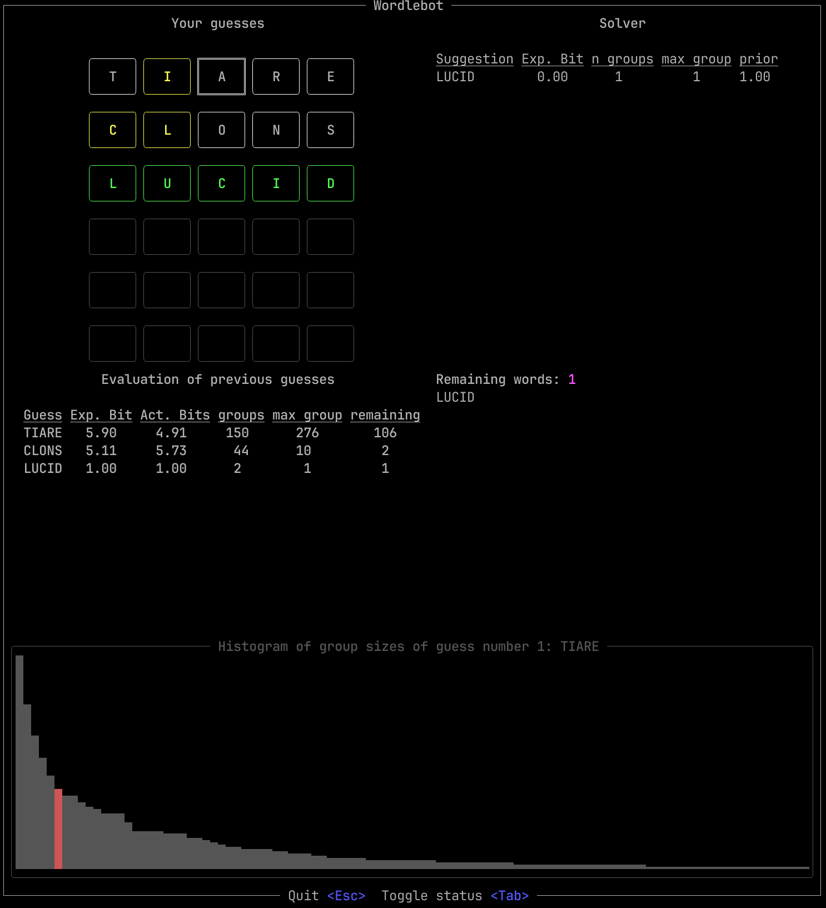

## Wordle solver

### Run

- `cargo run --release` for TUI
- `cargo run --release benchmark` for testing all words in the dictionary
- `cargo run --release solve water` get the steps to sovle for the word "water"
- `cargo run --release solve water -s slate` get the steps to sovle for the word "water". Use "slate" as a starting word.

### Commands in TUI

| Key                 | Command                            |
| ------------------- | ---------------------------------- |
| `a-z`               | Insert letter at selected position |
| `DEL`               | Delete letter at selected position |
| `TAB`               | Toggle status of letter            |
| `ArrowKeys`         | Select letter                      |

### Key status codes

| Status   |                                 |
| -------- | ------------------------------- |
| `white`  | Incorrect letter                |
| `yellow` | Misplaced letter                |
| `green`  | correct letter                  |

### Benchmark

Results of `cargo run --release benchmark`:

    0 words could not be solved in 6 guesses.
    The others have been solved in an average of 3.57 steps
    Here are the numbers for how many wordles have been solved in n steps.
    Steps 2: Count 69
    Steps 3: Count 1414
    Steps 4: Count 1523
    Steps 5: Count 175
    Steps 6: Count 8
